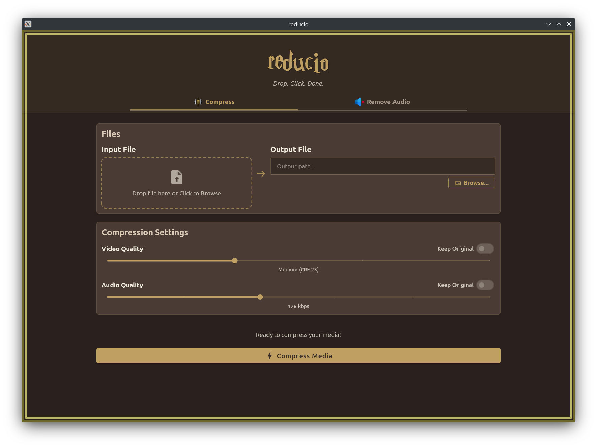
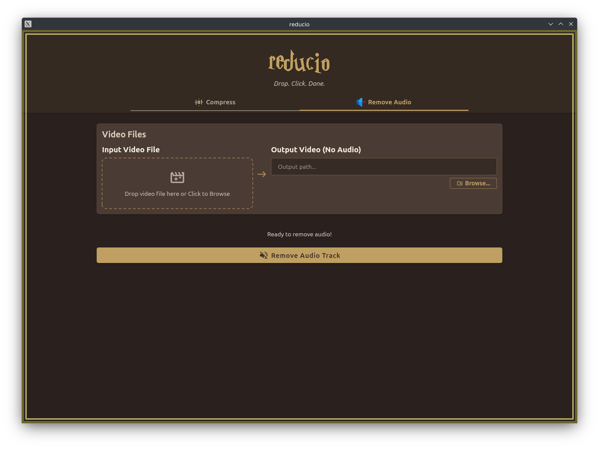

# 🪄 Reducio

Often times, I need to compress videos either to meet file size limits or just to speed up uploads. Sometimes I upload them to some online compressing tool.
Othertimes, I rely on ffmpeg if my video is too big (or) if the video is not supposed to be shared anywhere.

Blog here: https://citizendot.github.io/articles/reducio/

And every single time, I end up googling the same command from StackOverflow.

So, I built Reduccio, a tiny app that does just two things:

1. 📦 Compress Audio/Video files.
2. 🔇 Removes Audio track from video files.

That’s it.

No command line.
No upload limits.
No nonsense.
Just drag, drop, done; all offline.

## Screenshots

---
